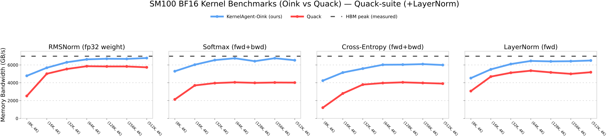
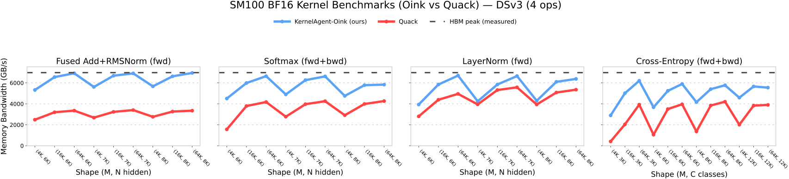

# KernelAgent-Oink

KernelAgent-Oink is a small **CuTeDSL (CUTLASS DSL) kernel library** for
**NVIDIA Blackwell (SM100 / GB200 / B200-class)**, bundled as a lightweight
Python package that can be used standalone or as a **vLLM general plugin**.

At the moment, the vLLM integration exposes the following `torch.library.custom_op`
entrypoints under the `oink::` namespace:

- `torch.ops.oink.rmsnorm(x, weight, eps) -> Tensor`
- `torch.ops.oink.fused_add_rms_norm(x, residual, weight, eps) -> None` (in-place)

The package also includes additional SM100 kernels used by the benchmark suite:
LayerNorm, Softmax (fwd+bwd), and CrossEntropy (fwd+bwd).

## Requirements

- GPU: **SM100** for the fast CuTeDSL paths. On other GPUs, Oink falls back to
  reference PyTorch implementations for correctness.
- Python dependencies:
  - `nvidia-cutlass-dsl` (CuTeDSL)
  - `cuda-python`
  - `torch` (provided by your environment / vLLM)

Recommended env vars:

```bash
export CUTE_DSL_ARCH=sm_100a
export PYTORCH_ALLOC_CONF=expandable_segments:True
```

## Install (editable)

From the `KernelAgent` repo root:

```bash
pip install -e ./oink
```

For running the in-repo benchmark suite / plots:

```bash
pip install -e "./oink[bench]"
```

## Usage

### vLLM (general plugin)

1) Enable the plugin:

```bash
export VLLM_USE_OINK_RMSNORM=1
```

2) Ensure vLLM keeps `rms_norm` as a custom op when using `torch.compile` / CUDA graphs:

```python
from vllm import LLM

llm = LLM(
    model=...,
    tensor_parallel_size=...,
    enforce_eager=False,
    compilation_config={"custom_ops": ["none", "+rms_norm"]},
)
```

Without `+rms_norm`, Inductor may fuse RMSNorm into larger kernels and neither
vLLM’s CUDA RMSNorm nor Oink will run.

### Direct PyTorch usage (manual op registration)

For standalone use (outside vLLM), register the custom ops once:

```python
import kernelagent_oink
import torch

kernelagent_oink.register(force=True)

x = torch.randn(1024, 4096, device="cuda", dtype=torch.bfloat16)
w = torch.randn(4096, device="cuda", dtype=torch.bfloat16)
y = torch.ops.oink.rmsnorm(x, w, 1e-6)
```

## Benchmarks

The repo includes a Quack-style benchmark suite (tables + SVG plots) to compare
Oink against Quack on SM100 and to reproduce the reported speedups.

- How to run + methodology: `oink/benchmarks/README.md`
- Pre-generated plots: `oink/benchmarks/media/`

<div align="center">
  
</div>

<div align="center">
  
</div>

## Links

| What | Link |
|---|---|
| Quack (expert baseline) | https://github.com/Dao-AILab/quack |
| KernelAgent (agentic framework) | https://github.com/meta-pytorch/KernelAgent |
| vLLM PR (Oink RMSNorm integration) | https://github.com/vllm-project/vllm/pull/31828 |
