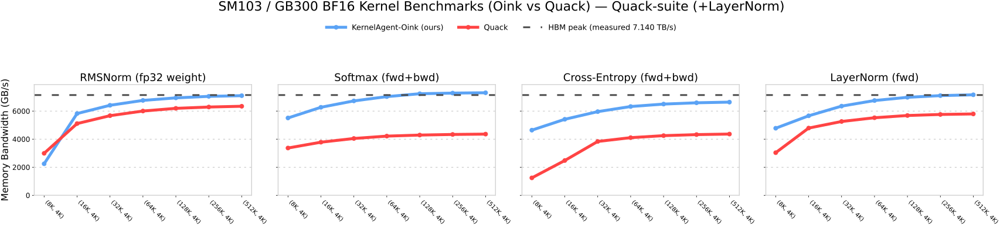

# KernelAgent-Oink

KernelAgent-Oink is a lightweight **CuTeDSL (CUTLASS DSL) kernel package** for
NVIDIA Blackwell **SM10x** GPUs. It can be used standalone or loaded as a
**vLLM general plugin**.

Current custom ops:

- `torch.ops.oink.rmsnorm(x, weight, eps) -> Tensor`
- `torch.ops.oink.fused_add_rms_norm(x, residual, weight, eps) -> None` (in-place)

The repo also contains benchmark-facing Blackwell kernels for LayerNorm, Softmax,
and CrossEntropy.

## Requirements

- Blackwell GPU for optimized CuTeDSL paths; other GPUs use correctness-first
  PyTorch fallbacks.
- `nvidia-cutlass-dsl>=4.4.2`
- `cuda-python`
- `torch` from the surrounding environment / vLLM

Recommended env vars:

```bash
export PYTORCH_ALLOC_CONF=expandable_segments:True
export CUTE_DSL_ARCH=sm_103a   # GB300 / SM103
# export CUTE_DSL_ARCH=sm_100a # GB200/B200 / SM100
```

## Install

From the `KernelAgent` repo root:

```bash
pip install -e ./oink
pip install -e "./oink[bench]"  # optional benchmark/plot deps
```

A reproducible GB300 benchmark environment used for the results below:

```bash
conda create -y -n cute python=3.12
conda run -n cute python -m pip install --upgrade pip setuptools wheel packaging ninja
conda run -n cute python -m pip install --upgrade --index-url https://download.pytorch.org/whl/cu130 torch
conda run -n cute python -m pip install 'nvidia-cutlass-dsl==4.4.2' cuda-python triton matplotlib
conda run -n cute python -m pip install -e './oink[bench]'
```

## Usage

### vLLM plugin

```bash
export VLLM_USE_OINK_RMSNORM=1
```

When using `torch.compile` / CUDA graphs, keep vLLM RMSNorm as a custom op:

```python
from vllm import LLM

llm = LLM(
    model=...,
    tensor_parallel_size=...,
    enforce_eager=False,
    compilation_config={"custom_ops": ["none", "+rms_norm"]},
)
```

### Direct PyTorch

```python
import kernelagent_oink
import torch

kernelagent_oink.register(force=True)

x = torch.randn(1024, 4096, device="cuda", dtype=torch.bfloat16)
w = torch.randn(4096, device="cuda", dtype=torch.bfloat16)
y = torch.ops.oink.rmsnorm(x, w, 1e-6)
```

## Benchmarks

Benchmark details and commands are in [`benchmarks/README.md`](benchmarks/README.md).
Reported numbers are correctness-gated against PyTorch references before timing.

Current GB300 / SM103 setup:

- NVIDIA GB300, capability `(10, 3)`, `CUTE_DSL_ARCH=sm_103a`
- `torch==2.11.0+cu130`, CUDA `13.0`
- `nvidia-cutlass-dsl==4.4.2`, `cuda-python==13.2.0`
- measured BF16 STREAM-like roof: **7.140 TB/s**

<div align="center">
  
</div>

Quack-suite BF16 summary (`N=4096`):

| op | rows | geomean vs Quack | large-row roofline note |
|---|---:|---:|---|
| RMSNorm fwd, weight=same | 19 | 1.019x | near measured roof on large rows |
| RMSNorm fwd, weight=fp32 | 19 | 1.100x | near measured roof on large rows |
| LayerNorm fwd | 19 | 1.241x | near measured roof on large rows |
| Softmax fwd+bwd | 19 | 1.673x | near measured roof on large rows |
| CrossEntropy fwd+bwd | 19 | 1.635x | mixed memory/SFU behavior |

Historical plots remain under `benchmarks/media/`:

- `sm100_*`: historical SM100 / B200 runs.
- `gb300_bf16_qk_norm_oink_vs_cutedsl_roofline.svg`: historical GB300 Q/K-norm
  harness, separate from the Quack-suite table above.

## Links

| What | Link |
|---|---|
| Quack baseline | https://github.com/Dao-AILab/quack |
| KernelAgent | https://github.com/meta-pytorch/KernelAgent |
| vLLM Oink RMSNorm PR | https://github.com/vllm-project/vllm/pull/31828 |
