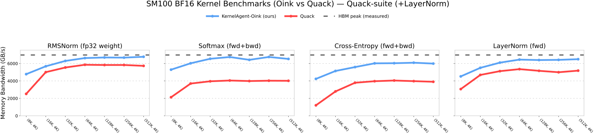
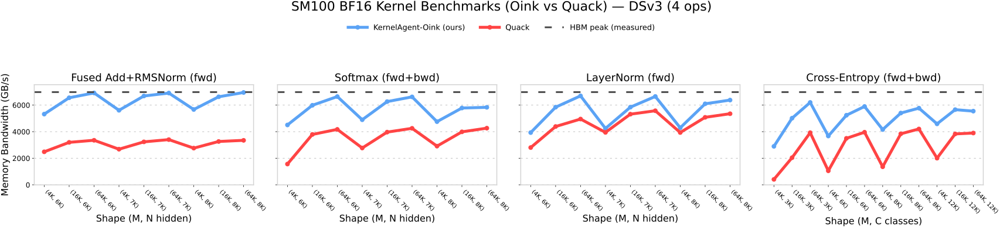
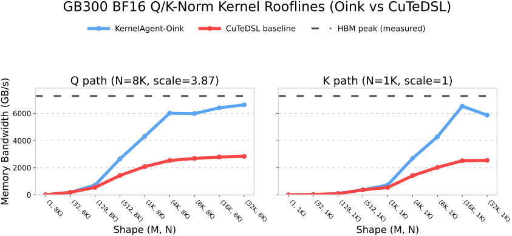

# KernelAgent-Oink

KernelAgent-Oink is a small **CuTeDSL (CUTLASS DSL) kernel library** for
**NVIDIA Blackwell (SM10x / GB200 / GB300 / B200-class)**, bundled as a lightweight
Python package that can be used standalone or as a **vLLM general plugin**.

At the moment, the vLLM integration exposes the following `torch.library.custom_op`
entrypoints under the `oink::` namespace:

- `torch.ops.oink.rmsnorm(x, weight, eps) -> Tensor`
- `torch.ops.oink.fused_add_rms_norm(x, residual, weight, eps) -> None` (in-place)

The package also includes additional SM100 kernels used by the benchmark suite:
LayerNorm, Softmax (fwd+bwd), and CrossEntropy (fwd+bwd).

## Requirements

- GPU: **SM10x (Blackwell)** for the fast CuTeDSL paths. On other GPUs, Oink falls back to
  reference PyTorch implementations for correctness.
- Python dependencies:
  - `nvidia-cutlass-dsl` (CuTeDSL)
  - `cuda-python`
  - `torch` (provided by your environment / vLLM)

Recommended env vars:

```bash
export CUTE_DSL_ARCH=sm_100a
export PYTORCH_ALLOC_CONF=expandable_segments:True
```

On **GB300 / SM103**, prefer:

```bash
export CUTE_DSL_ARCH=sm_103a
```

## Install (editable)

From the `KernelAgent` repo root:

```bash
pip install -e ./oink
```

For running the in-repo benchmark suite / plots:

```bash
pip install -e "./oink[bench]"
```

## Usage

### vLLM (general plugin)

1) Enable the plugin:

```bash
export VLLM_USE_OINK_RMSNORM=1
```

2) Ensure vLLM keeps `rms_norm` as a custom op when using `torch.compile` / CUDA graphs:

```python
from vllm import LLM

llm = LLM(
    model=...,
    tensor_parallel_size=...,
    enforce_eager=False,
    compilation_config={"custom_ops": ["none", "+rms_norm"]},
)
```

Without `+rms_norm`, Inductor may fuse RMSNorm into larger kernels and neither
vLLM’s CUDA RMSNorm nor Oink will run.

### Direct PyTorch usage (manual op registration)

For standalone use (outside vLLM), register the custom ops once:

```python
import kernelagent_oink
import torch

kernelagent_oink.register(force=True)

x = torch.randn(1024, 4096, device="cuda", dtype=torch.bfloat16)
w = torch.randn(4096, device="cuda", dtype=torch.bfloat16)
y = torch.ops.oink.rmsnorm(x, w, 1e-6)
```

## Benchmarks

### GB200 / B200 (SM100) benchmark suite

The repo includes a Quack-style benchmark suite (tables + SVG plots) to compare
Oink against Quack and to reproduce the reported speedups. The pre-generated
plots below were measured on **GB200 / B200-class SM100** systems.

In short, Oink’s edge comes from lower pointer-path launch overhead plus Blackwell-tuned shape routing for both hot small-`M` and larger RMSNorm rows.

On the current B200 forward sweep, Oink holds `1.12x` / `1.06x` geomean over Quack for same-dtype weights on the Quack-suite / DSv3 sets, and `1.18x` / `1.06x` for fp32 weights, with worst output rel-L2 `1.45e-5` (Quack `2.01e-5`).

- How to run + methodology: `oink/benchmarks/README.md`
- Pre-generated plots: `oink/benchmarks/media/`

<div align="center">
  
</div>

<div align="center">
  
</div>

### GB300 (SM103) Q/K-norm results

We also benchmarked the real Llama4x-style Q/K-norm workload on **GB300
(SM103)** using non-contiguous `q` / `k` views produced by `qkv.split()`. This
benchmark reports both the direct CuTeDSL/CUTLASS baseline and the optimized
Oink path for the production strided `[M, N]` views. The CuTeDSL/CUTLASS
baseline here is a **Q/K-norm adaptation** derived from the
[CUTLASS CuTeDSL Blackwell RMSNorm example](https://github.com/NVIDIA/cutlass/blob/main/examples/python/CuTeDSL/blackwell/rmsnorm.py),
not the example kernel used unchanged.

For roofline context, we also plot the same workload using a dedicated
useful-bandwidth harness: median CUDA-event timing plus a logical IO model of
one read + one write of the fused `[M, N]` tensor. This is the physically
meaningful view for comparing against the measured practical GB300 BF16 stream
roof, whereas the steady-state CUDA-graph replay medians below are better read
as a latency view.

<div align="center">
  
</div>

Representative steady-state CUDA-graph replay medians from one GB300 run are
shown below (absolute microseconds may vary slightly run to run, but the
ranking and trend were stable).

- Q path: Oink is roughly **2.4–3.1x faster** than the CuTeDSL baseline on
  representative multi-row workloads.
- K path: Oink is roughly **2.0–3.6x faster** on the same sweep.

Takeaways from the GB300 Q/K-norm sweep:

- For the user-relevant multi-row workloads, Oink beats the CuTeDSL/CUTLASS
  baseline by comfortably more than 20%.
- In the roofline view, Oink gets close to the practical GB300 BF16 streaming
  ceiling on the large-row Q/K shapes, while the CuTeDSL baseline stays much
  farther from the roof.
- The only cases below 20% are the tiny single-row latency-floor microcases:
  Q `M=1` is ~12% faster and K `M=1` is ~6% faster.
- Correctness spot-check from the same harness:
  - Q max diff vs eager: `0.03125`
  - K max diff vs eager: `0.007812`

## Links

| What | Link |
|---|---|
| Quack (expert baseline) | https://github.com/Dao-AILab/quack |
| KernelAgent (agentic framework) | https://github.com/meta-pytorch/KernelAgent |
| vLLM PR (Oink RMSNorm integration) | https://github.com/vllm-project/vllm/pull/31828 |
